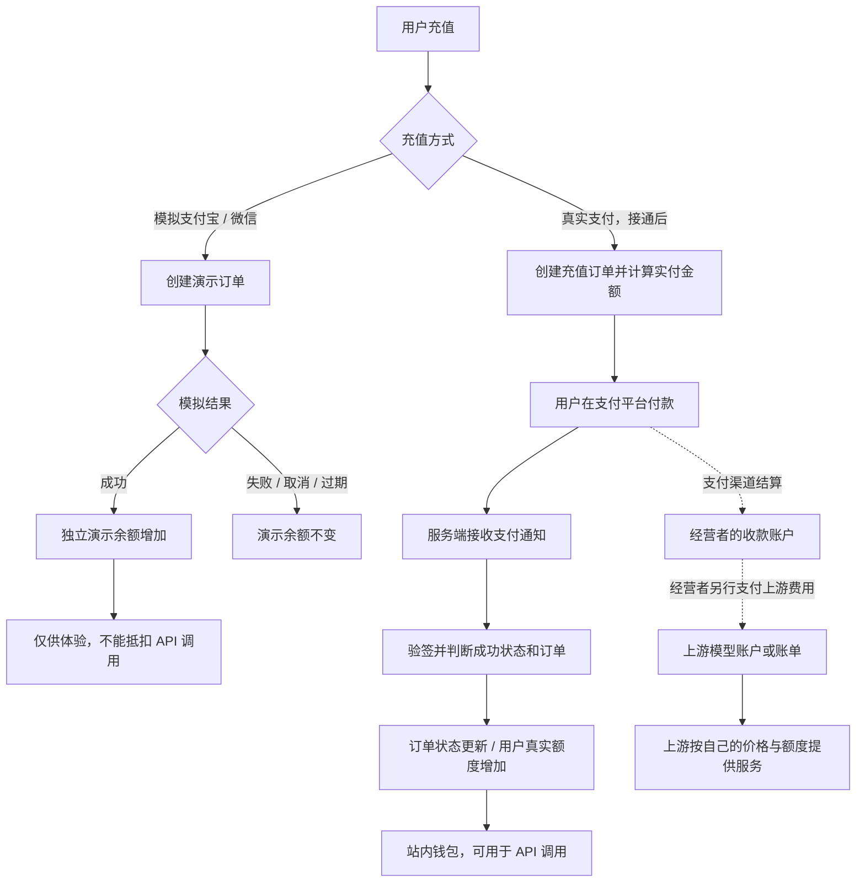
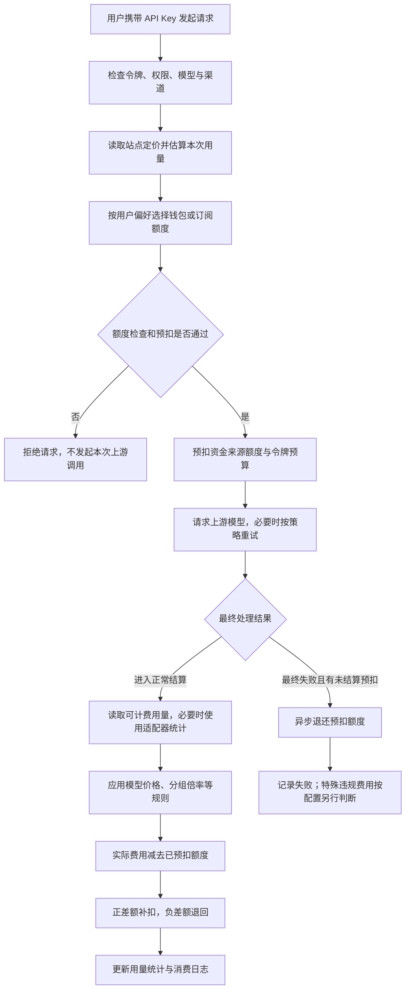

# 当前计费逻辑图解

核对日期：2026-09-23。根据本仓库代码整理；尚未读取阿里云实例的实时数据库，因此下图描述代码行为，不代表真实收款、上游渠道或特定模型价格已经配置。

## 1. 三种余额与资金流



- **演示余额：** `demo_payment_orders` 中成功订单的金额合计，单位为分。不写入用户真实额度、不生成真实充值记录，不请求支付宝或微信。订单 10 分钟过期，重复确认同一订单不会重复增加演示金额。
- **真实钱包：** 用户表的 `Quota`，是站内服务额度。真实充值、兑换码、管理员调整等可能增加它；余额本身并不能证明有对应现金收入。
- **上游账户：** 你在模型供应商处的余额、授信或账单，独立于本站。用户在本站充值不会自动给供应商充值。
- 支付手续费、服务器费用和供应商账单不是从本次用户扣费中自动计算出来的净利润。需要另外对账。

## 2. 一次模型调用怎样扣费



这是常见的收费文本调用路径。代码还包括以下分支：

- 免费模型跳过预扣；满足信任额度条件的钱包请求可能免实际预扣，后续仍结算。
- 默认偏好是订阅优先，无活跃订阅时用钱包；订阅不足是否转钱包，还受套餐是否允许超额回退限制。也支持仅钱包、仅订阅、钱包优先。它们不是同时向用户收两次费用。
- API Key 自身可以设置额度限制。钱包和令牌预算同步扣减，表示同一笔消费同时影响账户和该 Key 的预算，不是双倍扣费；无限额度令牌不等于用户钱包或上游免费。
- 失败时退回的是站内尚未结算的预扣，不是把充值款原路退回支付宝。退款为异步处理，异常时需查日志。
- 流式请求已经产生用量后，即使用户中途断开，也不能笼统理解成“失败就免费”；应看适配器得到的用量和是否已提交结算。
- 图片、音频、视频、异步任务和工具调用有各自计价/结算分支，不能一律套用普通文本公式。

## 3. 费用怎样计算

### 普通文本按 Token 计费的简化式

不涉及缓存、图片、音频、工具附加费、阶梯表达式或其他倍率时：

```text
扣除额度 Q ≈ (输入 Token 数 + 输出 Token 数 × 输出倍率)
             × 模型倍率 × 用户分组倍率
```

代码还会进行整数换算、极小费用处理和溢出保护。输入包括本次请求带来的历史上下文等，并不只算用户最后一句话。

默认 `QuotaPerUnit = 500000`：

```text
内部美元口径额度 = Q ÷ 500000
人民币展示金额 = Q ÷ 500000 × 后台配置的 USDExchangeRate
```

人民币符号是展示换算，不代表银行余额、实时外汇汇率或支付平台实收金额。这里的额度单位取自当前源码，展示汇率则需要核对实例后台设置。

示例仅用于理解，不是当前模型报价：

| 参数 | 假设值 |
| --- | --- |
| 输入 / 输出 Token | 1000 / 500 |
| 模型 / 输出 / 分组倍率 | 1 / 2 / 1 |
| 额度单位 / 人民币展示汇率 | 500000 / 7.3 |

计算得 `Q = (1000 + 500 × 2) × 1 × 1 = 2000`，即内部美元口径 `0.004`，人民币展示 `0.0292 元`。若预扣 3000，结算时退回 1000，最终只消耗 2000。

若模型配置为按次收费，基础费用改为 `模型单次价格 × QuotaPerUnit × 分组倍率`；缓存命中/写入、图片、音频、工具和表达式计费按对应规则处理。该价格来自本站配置，不是自动读取供应商账单再加固定利润。

### 真实充值的兑换规则（易支付路径）

```text
实付金额 = 后端充值数量 × Price × 充值分组倍率 × 充值折扣
到账额度 = 订单记录的充值数量 × QuotaPerUnit
```

以上是后端金额模式的基础公式；Token 展示模式另有数量换算，前端也可能转换展示值。不能将“后端充值数量”直接当作用户看到的人民币金额。充值实付比例、余额展示汇率和调用价格是不同设置，需要联调时一起核对。

用户支付后必须通过服务端通知处理；仅跳回成功页面，不构成入账依据。订阅购买则增加或激活套餐权益，不等同于钱包充值。

## 4. 真实收款上线前的代码边界

本版易支付回调已实现验签、成功状态判断、支付提供方判断，以及进程内订单锁和待支付状态检查。但当前 `EpayNotify` 在验签后先返回成功，再进行订单更新及余额增加；两次数据库写入也没有包在同一事务中，且该函数未显式比较回调金额与订单应付金额。因此不能把图中的入账环节理解为“已验证的跨节点原子入账”。

接真实收款前应补齐金额核对、事务入账和跨进程幂等，并验证写入失败后的重试与对账。这是从当前代码观察到的边界，本次图解未修改支付逻辑，也未发起真实付款。

## 5. 代码依据

| 行为 | 源码 |
| --- | --- |
| 模拟充值与独立余额 | [model/demo_payment.go](../../model/demo_payment.go) |
| 易支付实付计算、下单与回调 | [controller/topup.go](../../controller/topup.go) |
| 请求预扣、失败回退 | [controller/relay.go](../../controller/relay.go) |
| 钱包/订阅选择、结算差额与异步退款 | [service/billing_session.go](../../service/billing_session.go) |
| 文本、缓存及附加用量计算 | [service/text_quota.go](../../service/text_quota.go) |
| 用量来源处理 | [service/billing_usage.go](../../service/billing_usage.go) |
| 默认额度单位 | [common/constants.go](../../common/constants.go) |
| 充值价格与展示汇率默认值 | [setting/operation_setting/payment_setting_old.go](../../setting/operation_setting/payment_setting_old.go) |

要输出“这台线上实例每个模型实际扣多少钱”的价目表，还需要读取其模型定价、分组倍率、展示汇率、充值折扣和订阅设置；本图解不推测这些实时值。
